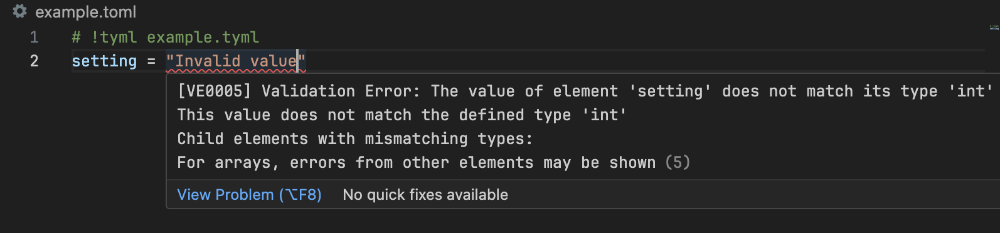

+++
title = "QuickStart"
description = "Getting Started"
weight = 2
+++

# Install on VSCode
Open VS Code and download **[`TYML for VSCode`](https://marketplace.visualstudio.com/items?itemName=bea4dev.tyml-lsp-vscode)** from the Extensions Marketplace.

# Declare a type
Create a file named `example.tyml` in any folder with the following content:

```tyml
setting: int
````

This declares that a configuration value called `setting` has type `int`.

# Enable type checking

Next, in the same folder create a file named `example.toml` like this:

```toml
# !tyml example.tyml
setting = "invalid value"
```

You should see an error due to type checking.



Finally, fix the file as follows:

```toml
# !tyml example.tyml
setting = 100
```

The error should disappear.
